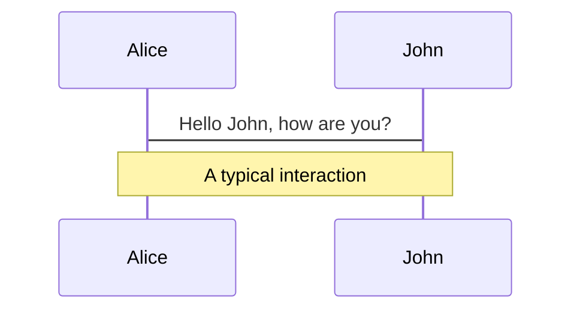
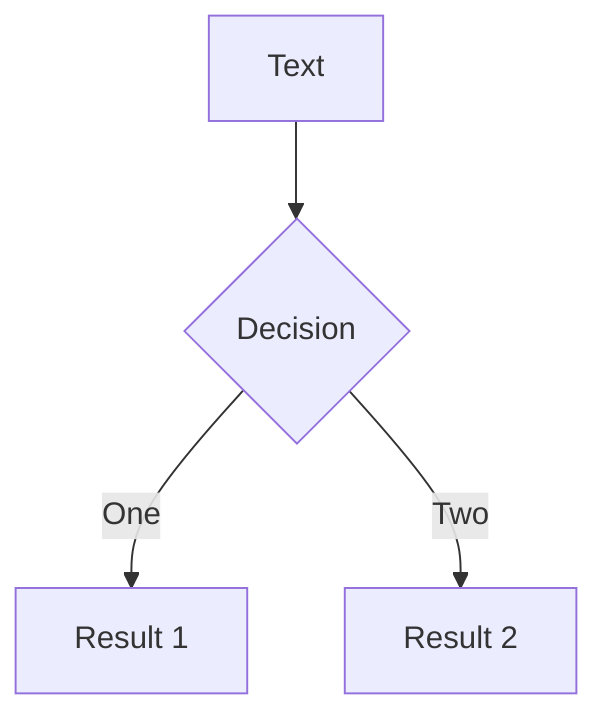
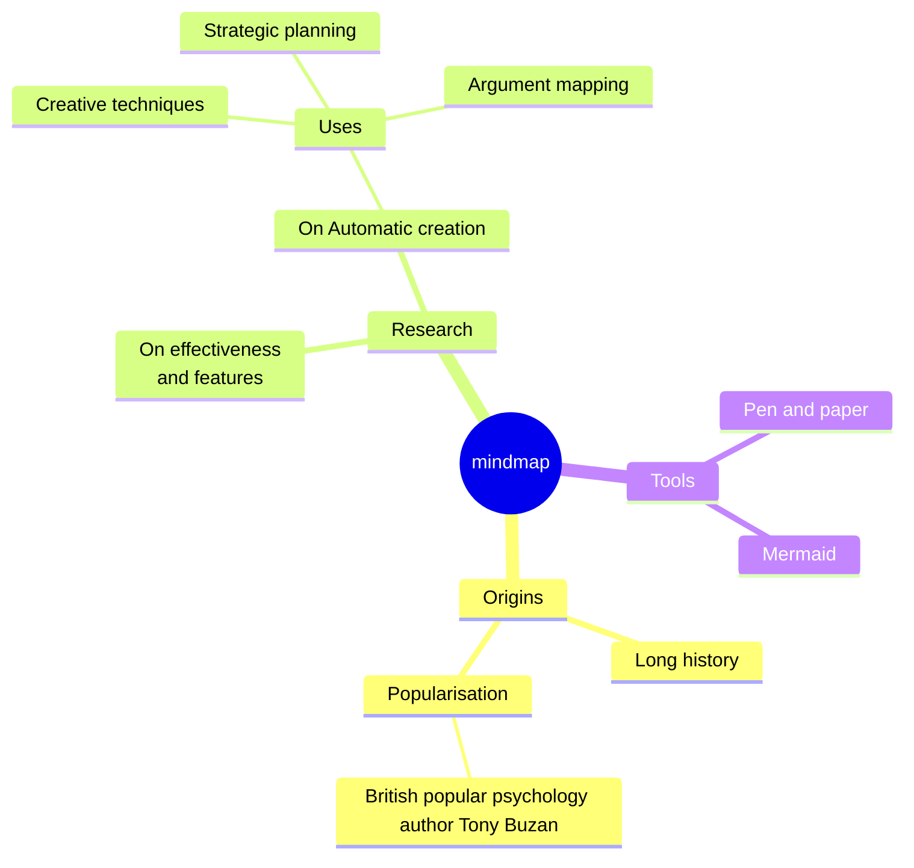
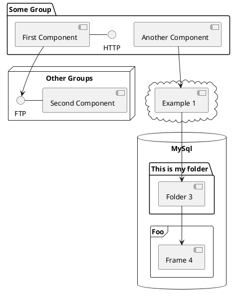

# Generative AI For The Rest Of Us(plebs)

Nzai Kilonzo

<div class="pt-12">
  <span @click="$slidev.nav.next" class="px-2 py-1 rounded cursor-pointer" hover="bg-white bg-opacity-10">
    Press Space for next page <carbon:arrow-right class="inline"/>
  </span>
</div>

<div class="abs-br m-6 flex gap-2">
  <button @click="$slidev.nav.openInEditor()" title="Open in Editor" class="text-xl slidev-icon-btn opacity-50 !border-none !hover:text-white">
    <carbon:edit />
  </button>
  <a href="https://github.com/mundume" target="_blank" alt="GitHub" title="Open in GitHub"
    class="text-xl slidev-icon-btn opacity-50 !border-none !hover:text-white">
    <carbon-logo-github />
  </a>
</div>

<!--
Welcome everyone! Today we'll explore the practical applications of generative AI for everyday developers.
-->

---

# Nzai Kilonzo

Junior Dev For Life.

<div class="leading-8 opacity-80">I build cool shit <br>
Big fan of The lord of the rings(and yes The Rings Of Power is Trash)<br>
</div>

<div class="abs-br m-6 flex gap-2">
  <a href="https:x.com/nzai__" target="_blank" alt="GitHub" title="Open in X" class="text-xl slidev-icon-btn opacity-50 !border-none !hover:text-white">
    <carbon:logo-x />
  </a>
  <a href="https://github.com/mundume" target="_blank" alt="GitHub" title="Open in GitHub"
    class="text-xl slidev-icon-btn opacity-50 !border-none !hover:text-white">
    <carbon-logo-github />
  </a>
</div>

<!--
A brief introduction about myself and my mission to make AI more accessible to developers of all skill levels.
-->

---

# Why This Talk / Mini-Workshop?

- Have fun.
- Practical, hands-on learning.
- Build something by the end of the talk

<!--
Let's break down AI development into approachable, practical steps that everyone can understand and implement.
-->

---

# What We'll Cover

- Generative AI Basics
- Next.js Integration using the vercel AI SDK.
- Working with vision LLM models and text models.
- How to write good prompts.
- RAG(Retrieval Augmented Generation)
- Real-world Examples
- Practical Tips

::right::

<div class="ml-4">

## You'll Learn:

- Setting up AI in your apps using the Vercel AI SDK
- Working with AI responses
- Fine-tuning LLM models to return better results.
- Managing AI states.
- Best practices

</div>

<!--
We'll focus on practical, hands-on learning that you can apply to your projects right away.
-->

---

# Prerequisites

- Nothing, Just smile.

<!--
You can have `style` tag in markdown to override the style for the current page.
Learn more: https://sli.dev/features/slide-scope-style
-->

<style>

</style>

<!--
Here is another comment.
-->

---

# What are you going to build then?

<div class="flex items-center gap-4 text-2xl text-emerald-300">
A wireframe or a screenshot to  a Expo react native app with an embedded chat to further experimenting on the design (ghetto V0)
</div>

---

# The Stack

- Next.js v14(app router)
- Tailwindcss(using the goated Shadcn UI)
- Vercel AI SDK
- Llama 3.2 vision 90B(served through groq)
- Llama 3.2 text 90B(served through groq)
- Expo snack sdk for live preview

---

# Why the Stack?

- React(i mean its react)
- Edge runtime
- The app router is so cool
- The vercel AI SDK is so powerful and easy to use.
- Groq is free and fast(only cohere is faster).

---

### The Basics.

#### Generate Text

<div class="text-sm">
You can generate text using the <span class="font-bold text-emerald-300">generateText</span> function. This function is ideal for non-interactive use cases where you need to write text (e.g. drafting email or summarizing web pages) and for agents that use tools.
</div>

````md magic-move {lines: true}
```tsx
import { generateText } from "ai";
import { openai } from "@ai-sdk/openai";

export async function POST(req: Request) {
  const { prompt }: { prompt: string } = await req.json();

  const { text } = await generateText({
    model: openai("gpt-4"),
    system: "You are a helpful assistant.",
    prompt,
  });

  return Response.json({ text });
}
```

```tsx
import { useState } from "react";

export default function Page() {
  const [generation, setGeneration] = useState("");
  const [isLoading, setIsLoading] = useState(false);

  return (
    <div>
      <div
        onClick={async () => {
          setIsLoading(true);

          await fetch("/api/completion", {
            method: "POST",
            body: JSON.stringify({
              prompt: "Why is the sky blue?",
            }),
          }).then((response) => {
            response.json().then((json) => {
              setGeneration(json.text);
              setIsLoading(false);
            });
          });
        }}
      >
        Generate
      </div>

      {isLoading ? "Loading..." : generation}
    </div>
  );
}
```
````

---

## StreamText

<div class="text-sm">
Depending on your model and prompt, it can take a large language model (LLM) up to a minute to finish generating it's response. This delay can be unacceptable for interactive use cases such as chatbots or real-time applications, where users expect immediate responses.
AI SDK Core provides the streamText function which simplifies streaming text from LLMs
</div>

````md magic-move {lines: true}
```ts
import { streamText } from "ai";
import { groq } from "@ai-sdk/groq";

export async function POST(req: Request) {
  const { prompt }: { prompt: string } = await req.json();

  const result = await streamText({
    model: groq("llama-3-70B-versatile"),
    system: "You are a helpful assistant.",
    prompt,
  });

  return result.toDataStreamResponse();
}
```

```tsx
import { useCompletion } from "ai/react";

export default function Page() {
  const { completion, complete } = useCompletion({
    api: "/api/completion",
  });

  return (
    <div>
      <div
        onClick={async () => {
          await complete("Why is the sky blue?");
        }}
      >
        Generate
      </div>

      {completion}
    </div>
  );
}
```
````

---

## GenerateObject

<div class="text-sm">
The generateObject generates structured data from a prompt. The schema is also used to validate the generated data, ensuring type safety and correctness.
</div>

````md magic-move {lines: true}
```ts
// Generate Object - generate Objects from a zod schema
import { generateObject } from "ai";
import { groq } from "@ai-sdk/groq";
import { z } from "zod";

export async function POST(req: Request) {
  const { prompt }: { prompt: string } = await req.json();

  const result = await generateObject({
    model: groq("llama-3-70B-versatile"),
    system: "You generate three notifications for a messages app.",
    prompt,
    schema: z.object({
      notifications: z.array(
        z.object({
          name: z.string().describe("Name of a fictional person."),
          message: z.string().describe("Do not use emojis or links."),
          minutesAgo: z.number(),
        })
      ),
    }),
  });

  return result.toJsonResponse();
}
```

```tsx
import { useState } from "react";

export default function Page() {
  const [generation, setGeneration] = useState();
  const [isLoading, setIsLoading] = useState(false);

  return (
    <div>
      <div
        onClick={async () => {
          setIsLoading(true);

          await fetch("/api/completion", {
            method: "POST",
            body: JSON.stringify({
              prompt: "Messages during finals week.",
            }),
          }).then((response) => {
            response.json().then((json) => {
              setGeneration(json.object);
              setIsLoading(false);
            });
          });
        }}
      >
        Generate
      </div>

      {isLoading ? "Loading..." : <pre>{JSON.stringify(generation)}</pre>}
    </div>
  );
}
```
````

---

### StreamObject

<div class="text-sm">
The streamObject generates structured data from a prompt. The schema is also used to validate the generated data, ensuring type safety and correctness.
</div>

````md magic-move {lines: true}
```ts
// Generate Object - generate Objects from a zod schema

import { groq } from "@ai-sdk/groq";
import { streamObject } from "ai";
import { notificationSchema } from "./schema";

// Allow streaming responses up to 30 seconds
export const maxDuration = 30;

export async function POST(req: Request) {
  const context = await req.json();

  const result = await streamObject({
    model: groq("llama-3-70B-versatile"),
    schema: notificationSchema,
    prompt:
      `Generate 3 notifications for a messages app in this context:` + context,
  });

  return result.toTextStreamResponse();
}
```

```tsx
"use client";

import { experimental_useObject as useObject } from "ai/react";
import { notificationSchema } from "./api/use-object/schema";

export default function Page() {
  const { object, submit } = useObject({
    api: "/api/use-object",
    schema: notificationSchema,
  });

  return (
    <div>
      <button onClick={() => submit("Messages during finals week.")}>
        Generate notifications
      </button>

      {object?.notifications?.map((notification, index) => (
        <div key={index}>
          <p>{notification?.name}</p>
          <p>{notification?.message}</p>
        </div>
      ))}
    </div>
  );
}
```
````

---

# Tools

A `tool` is a function that can be called by the model to perform a specific task. You can think of a tool like a program you give to the model that it can run as and when it deems necessary.
A tool usually has 3 elements

- description - a short description of what the tool does
- parameters - a schema for the parameters that the tool takes
- execute - the function that the tool runs

---

## Tool Example

```ts {1-3|7-17|all}
import { generateText, tool } from "ai";
import { groq } from "@ai-sdk/groq";

const { text } = await generateText({
  model: groq("llama-3.1-70b-versatile"),
  prompt: "What is the weather like today?",
  tools: {
    weather: tool({
      description: "Get the weather in a location",
      parameters: z.object({
        location: z.string().describe("The location to get the weather for"),
      }),
      execute: async ({ location }) => ({
        location,
        temperature: 72 + Math.floor(Math.random() * 21) - 10,
      }),
    }),
  },
});
```

<!--
we duuh
-->

---

# RAG(Retrieval Augmented Generation)

## What is RAG?

RAG stands for retrieval augmented generation. In simple terms, RAG is the process of providing a Large Language Model (LLM) with specific information relevant to the prompt.

## Why is RAG important?

While LLMs are powerful, the information they can reason on is restricted to the data they were trained on. This problem becomes apparent when asking an LLM for information outside of their training data, like proprietary data or common knowledge that has occurred after the model’s training cutoff. RAG solves this problem by fetching information relevant to the prompt and then passing that to the model as context.

---

# Basic RAG Example(Dont ever do this )

```ts
import { streamText } from "ai";
import { openai } from "@ai-sdk/openai";

export async function POST(req: Request) {
  const { prompt }: { prompt: string } = await req.json();

  const result = await streamText({
    model: openai("gpt-4"),
    system: `You are a helpful assistant. If the user asks you anything about love and relationships, you will respond with \baby dont hurt me no more\n\ You can use your own intuition on other things blud.`,

    prompt,
  });

  return result.toDataStreamResponse();
}
```

---

# LaTeX

LaTeX is supported out-of-box. Powered by [KaTeX](https://katex.org/).

<div h-3 />

Inline $\sqrt{3x-1}+(1+x)^2$

Block

$$
{1|3|all}
\begin{aligned}
\nabla \cdot \vec{E} &= \frac{\rho}{\varepsilon_0} \\
\nabla \cdot \vec{B} &= 0 \\
\nabla \times \vec{E} &= -\frac{\partial\vec{B}}{\partial t} \\
\nabla \times \vec{B} &= \mu_0\vec{J} + \mu_0\varepsilon_0\frac{\partial\vec{E}}{\partial t}
\end{aligned}
$$

[Learn more](https://sli.dev/features/latex)

---

# Diagrams

You can create diagrams / graphs from textual descriptions, directly in your Markdown.

<div class="grid grid-cols-4 gap-5 pt-4 -mb-6">









</div>

Learn more: [Mermaid Diagrams](https://sli.dev/features/mermaid) and [PlantUML Diagrams](https://sli.dev/features/plantuml)

---

foo: bar
dragPos:
square: 691,32,167,\_,-16

---

dragPos:
square: -162,0,0,0

---

dragPos:
square: -162,0,0,0

---

dragPos:
square: -162,0,0,0

---

dragPos:
square: -162,0,0,0

---

dragPos:
square: -162,0,0,0

---

dragPos:
square: -162,0,0,0

---

dragPos:
square: -162,0,0,0

---

dragPos:
square: -162,0,0,0

---

dragPos:
square: -162,0,0,0

---

dragPos:
square: -162,0,0,0

---

dragPos:
square: -162,0,0,0

---

dragPos:
square: -162,0,0,0

---

dragPos:
square: -162,0,0,0

---

dragPos:
square: -162,0,0,0

---

dragPos:
square: -162,0,0,0

---

dragPos:
square: -162,0,0,0

---

dragPos:
square: -162,0,0,0

---
dragPos:
  square: -162,0,0,0
---

# Draggable Elements

Double-click on the draggable elements to edit their positions.

<br>

###### Directive Usage

```md

```

<br>

###### Component Usage

```md
<v-drag text-3xl>
  <carbon:arrow-up />
  Use the `v-drag` component to have a draggable container!
</v-drag>
```

<v-drag pos="566,93,261,\_,-15"undefinedundefinedundefinedundefinedundefinedundefinedundefinedundefinedundefinedundefinedundefinedundefinedundefinedundefinedundefinedundefinedundefinedundefinedundefinedundefinedundefinedundefinedundefinedundefinedundefinedundefinedundefinedundefinedundefinedundefinedundefinedundefinedundefinedundefinedundefinedundefinedundefinedundefinedundefinedundefinedundefinedundefinedundefinedundefinedundefinedundefinedundefinedundefinedundefinedundefinedundefined>

  <div text-center text-3xl border border-main rounded>
    Double-click me!
  </div>
</v-drag>


###### Draggable Arrow

```md
<v-drag-arrow two-way />
```

<v-drag-arrow pos="67,452,253,46" two-way op70 />

---

src: ./pages/imported-slides.md
hide: false

---


---

# Monaco Editor

Slidev provides built-in Monaco Editor support.

Add `{monaco}` to the code block to turn it into an editor:

```ts {monaco}
import { ref } from "vue";
import { emptyArray } from "./external";

const arr = ref(emptyArray(10));
```

Use `{monaco-run}` to create an editor that can execute the code directly in the slide:

```ts {monaco-run}
import { version } from "vue";
import { emptyArray, sayHello } from "./external";

sayHello();
console.log(`vue ${version}`);
console.log(
  emptyArray<number>(10).reduce(
    (fib) => [...fib, fib.at(-1)! + fib.at(-2)!],
    [1, 1]
  )
);
```

---

layout: center
class: text-center

---

# Learn More

[Documentation](https://sli.dev) · [GitHub](https://github.com/slidevjs/slidev) · [Showcases](https://sli.dev/resources/showcases)

<PoweredBySlidev mt-10 />
